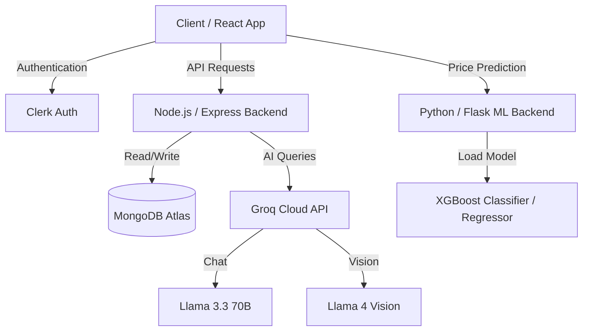

# AgriNexus 🌾

[](https://nodejs.org/)
[](https://react.dev/)
[](https://www.mongodb.com/atlas/database)
[](https://groq.com/)
[](https://xgboost.readthedocs.io/)
[](LICENSE)

> **AgriNexus** is a full-stack, AI-powered agricultural ecosystem designed to eliminate middlemen, empower local farmers, and connect them directly with buyers. The platform integrates machine learning for price prediction, Llama-based AI models for plant health diagnosis, interactive mapping for local listings, and specialized marketplaces for crops, nurseries, and aquaculture.

---

## 🗺️ System Overview



---

## ✨ Features

### 🛒 Multi-Category Marketplace
*   **🌾 Crop Market:** Direct sales of agricultural produce with customized tags for variety, grade, and harvest date.
*   **🐟 Aquaculture (Fish Market):** Real-time booking of seafood harvests, ownership-verified listings, and city-based geolocation filters.
*   **🌱 Nursery & Forestry Market:** High-quality saplings categorized by age and type, complete with farm coordinates for easy pickup.

### 🤖 AgriNexus AI Assistant (Groq Cloud)
*   **Context-Aware Chat:** Built on Llama 3.3 70B for lightning-fast agricultural guidance.
*   **Image Analysis:** Leverages Llama 4 Vision to analyze uploaded plant images and diagnose crop diseases, offering organic and chemical remediation steps.
*   **Ubiquitous Interface:** Accessible globally across the app via a floating conversation modal.

### 📊 Machine Learning Price Prediction
*   **Data-Driven Decisions:** Powered by XGBoost models trained on over **200,000 records** of regional agricultural prices.
*   **Outputs:** Predicts the Minimum, Maximum, and Modal price for target crops to prevent underpricing.

### 🚜 Equipment Certification & Rental
*   **Trusted Directory:** Farmers can submit certified requests for machinery and equipment rentals, creating a safe, decentralized utility pool.

### 🗺️ Interactive GIS Mapping
*   **Zero Cost Integration:** Built using OpenStreetMap and Leaflet JS to map nearby listings without expensive Google Maps API key requirements.

### 📚 Government Portal & Educational Suite
*   **Govt Schemes:** Direct access and instructions for schemes like PM-KISAN, PMFBY, and RKVY.
*   **Agri-Education:** Curated links and metadata to courses from FAO, edX, Coursera, and Swayam.

---

## 💻 Tech Stack

| Domain | Technology | Usage |
| :--- | :--- | :--- |
| **Frontend** | React.js (Vite), Framer Motion, Recharts, Leaflet | Client SPA, UI/UX Animations, Analytics, OSM Mapping |
| **Authentication** | Clerk Auth | Role-based authentication (Farmer/Buyer) |
| **Backend** | Node.js, Express.js | Core API gateway, DB routing, and AI middleware |
| **ML Service** | Python, Flask, Joblib, Scikit-learn, XGBoost | Crop valuation and prediction services |
| **Database** | MongoDB Atlas, Mongoose | Schema definitions for Users, Crops, Fish, Saplings, and Orders |
| **AI Integration** | OpenAI SDK (via Groq Engine) | Llama 3.3 & Llama 4 Vision integrations |

---

## 📂 Repository Structure

```
AgriNexus/
├── backend/                # Node.js/Express Server
│   ├── models/             # Mongoose schemas (Crops, Fish, Saplings, etc.)
│   ├── routers/            # Express routers (User, Farmer, Buyer, Nursery, Fish)
│   └── index.js            # Express Entrypoint
├── frontend/               # React Single Page App
│   ├── src/
│   │   ├── components/     # Reusable UI widgets & Navbar
│   │   ├── pages/          # Crop, Fish, and Nursery Markets, Profile, and Settings
│   │   └── App.jsx         # Client routing configuration
├── model-backend/          # Python/Flask Machine Learning Server
│   ├── models/             # Pre-trained .joblib XGBoost models
│   ├── server.py           # Prediction API Server
│   └── requirements.txt    # Python dependencies
└── README.md
```

---

## 🛠️ Installation & Setup

### 1. Clone the Repository
```bash
git clone https://github.com/ayanhakeem/AgriNexus.git
cd AgriNexus
```

### 2. Backend Configuration
1. Navigate to the backend directory and install dependencies:
   ```bash
   cd backend
   npm install
   ```
2. Create a `.env` file in the `backend` folder:
   ```env
   PORT=8080
   MONGO_URI=your_mongodb_connection_string
   CLERK_API_KEY=your_clerk_secret_key
   GROK_API_KEY=your_groq_api_key
   ```
3. Start the server:
   ```bash
   node index.js
   ```

### 3. Frontend Configuration
1. Navigate to the frontend directory and install dependencies:
   ```bash
   cd ../frontend
   npm install
   ```
2. Create a `.env` file in the `frontend` folder:
   ```env
   VITE_BACKEND_URL=http://localhost:8080
   VITE_CLERK_PUBLISHABLE_KEY=your_clerk_publishable_key
   ```
3. Run the development build:
   ```bash
   npm run dev
   ```

### 4. Machine Learning Backend Configuration
1. Navigate to the model-backend directory:
   ```bash
   cd ../model-backend
   ```
2. Set up your virtual environment and install requirements:
   ```bash
   python -m venv venv
   source venv/bin/activate  # On Windows use: venv\Scripts\activate
   pip install -r requirements.txt
   ```
3. Start the Flask prediction server:
   ```bash
   python server.py
   ```
   > **Note:** Pre-trained models (`xgboost_model_*.joblib`) are automatically bundled inside the `model-backend/models/` folder.

---

## 📡 Key API Reference

### 🌾 Crop Management
*   `GET /api/farmer/allCrops` — Retrieve all available crops.
*   `POST /api/farmer/addCrop` — Publish a new crop listing.

### 🐟 Aquaculture Marketplace
*   `GET /api/fish/all` — Fetch all fish listings.
*   `GET /api/fish/search?city=CityName` — Filter fish listings by city.
*   `POST /api/fish/add` — Add a new aquaculture listing.
*   `DELETE /api/fish/:fishId` — Remove aquaculture listing (Authorization: Creator or Admin).

### 🌱 Nursery & Forestry
*   `GET /api/nursery/all` — Retrieve all nursery listings.
*   `GET /api/nursery/search?city=CityName` — Filter nursery listings by location.
*   `POST /api/nursery/add` — List a new sapling.

### 🤖 AI Engine
*   `POST /api/gemini/chat` — Conversational agricultural chat helper.
*   `POST /api/gemini/analyze-image` — Disease classification from image attachments.

---

## 🤝 Contributing

We welcome contributions to expand features, improve UI/UX, or optimize our ML model predictions.

1. Fork the repo.
2. Create a feature branch: `git checkout -b feature/AmazingFeature`
3. Commit your changes: `git commit -m 'Add AmazingFeature'`
4. Push to the branch: `git push origin feature/AmazingFeature`
5. Open a Pull Request.

---

## 📄 License

Distributed under the MIT License. See [LICENSE](LICENSE) for more details.
